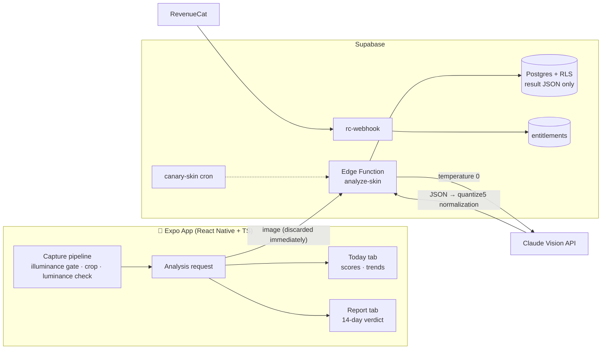

<p align="center">
  
</p>

<p align="center"><b>Your mirror lies to you every day.</b><br/>
A mobile app that measures your skin from a single selfie, then tells you 14 days later whether your skincare product actually worked</p>

<p align="center">
  
  
  
  
  
</p>

<p align="center"><a href="docs/ko/README.md">한국어</a> | English</p>

---

## What it does

You keep using skincare products, but nobody answers the question "is this actually working?" SkinMe answers it with numbers.

- **Today tab**
  - Take a selfie and the AI scores 6 metrics: pores, texture, blemishes, oil/moisture balance, redness, and tone/pigmentation.
- **Report tab**
  - Register a product and 14 days later you get a verdict: improved, no change, or worse, compared to your starting point.
  - 14 days is the biological lower bound of the skin turnover cycle, so it stays fixed.
- **No ads, no product sales**
  - A neutral verdict is the whole reason this product exists.

## Making the numbers trustworthy

A measurement app lives or dies by reproducibility. Measuring the same moment twice must produce the same number. This project moved forward only after confirming zero deviation across all metrics in real-device tests.

**Input control (capture pipeline)**
- Oval guide overlay with a single source of truth for coordinates (`constants/faceGuide.ts`)
- Illuminance gate: blocks extreme darkness, then compensates lighting with a white screen flash
- 2-shot burst per shutter press, followed by a center-60% luminance check. Failing shots are discarded and the user is asked to retake
- Oval bounding crop (+10% padding), original photo deleted immediately

**Output control (analysis pipeline)**
- Claude Vision calls pinned to `temperature 0`
- Every score snaps to 5-point bands (multiples of 5). The prompt instructs it and server-side `quantize5` enforces it (prompts instruct, code enforces)
- Two-tier metrics: structural metrics (pores, texture, blemishes) are always scored, color metrics (redness, tone, pigmentation) only under good lighting. Otherwise the app shows "measurement held" with the reason instead of hiding it
- Prompts are versioned as `prompts/skin-analysis-v0.3 → v0.10`, and the `sync-prompt` script triple-checks the sha across local source, generated file, and deployed build

**Server-side defense**
- Supabase RLS: own-row select/insert/update/delete policies on every table
- Free-tier usage cap enforced server-side (client checks are just a UX guard)
- Canary cron (`canary-skin`) continuously monitors the analysis pipeline
- Anonymous auth, with entitlements synced through the RevenueCat webhook on purchase

**Privacy**
- Photos are never stored on the server. They are discarded right after analysis and only the result JSON is saved
- No base64 in logs, and discarded photos are verified deleted at the file level

## Architecture



## Stack

| Area | Tech |
|---|---|
| App | Expo SDK 54 · React Native 0.81 · TypeScript (strict) · expo-router |
| Capture/Sensors | expo-camera · expo-brightness · expo-sensors · expo-image-manipulator |
| Backend | Supabase (anonymous Auth · Postgres/RLS · Edge Functions) |
| AI Analysis | Anthropic Claude (vision, temperature 0) · versioned prompts |
| Payments | RevenueCat (subscriptions · webhook entitlement sync) |
| Build/Deploy | EAS Build · `supabase functions deploy --use-api` |

## Project structure

```
app/                    # expo-router screens
  (tabs)/today.tsx      #   Today tab: snapshot, scores, trends
  (tabs)/verdict.tsx    #   Report tab: product registration, 14-day verdict
  capture.tsx           #   capture flow
  paywall.tsx           #   paywall
components/             # capture / today / verdict / paywall / dev
lib/
  analysis/             # analysis request & schema (zod)
  verdict/              # verdict logic (baseline & change calculation)
  purchases/            # RevenueCat integration
  faceCrop.ts luminance.ts photoQuality.ts ...
constants/              # strings.ts · faceGuide.ts (single source for coordinates)
supabase/
  functions/            # analyze-skin · canary-skin · rc-webhook · delete-account
  migrations/           # 20+ migrations: RLS policies, rate limit, entitlements
prompts/                # analysis prompts v0.3 → v0.10 (versioned)
scripts/sync-prompt.mjs # triple sha check: source ↔ generated ↔ deployed
docs/                   # audit docs, security reviews, test checklists
landing/                # landing page, privacy policy
```

## Getting started

```bash
npm install
cp .env.example .env    # fill in Supabase URL/anon key and RevenueCat key
npx expo start
```

For the backend, apply `supabase/migrations` to your Supabase project and deploy the edge functions:

```bash
supabase db push
npm run sync-prompt          # generate prompt.gen.ts and verify sha
supabase functions deploy analyze-skin --use-api
```

`ANTHROPIC_API_KEY` never lives in the client. It is managed only through `supabase secrets`.

## Rules I kept during development

- **Weekly gates**: real-device E2E → reproducibility deviation ≤5 (measured 0) → paywall → launch. No moving to the next week before passing the gate
- **Self audits**: payment bypass paths (deep-link cap bypass, etc.), security, and privacy audited item by item, recorded with P0/P1 priorities in `docs/audit-w3.md`
- **No features without scientific grounding**: 1-day or 1-week verdicts are permanently excluded, no matter who asks

## License

MIT © dandel6
