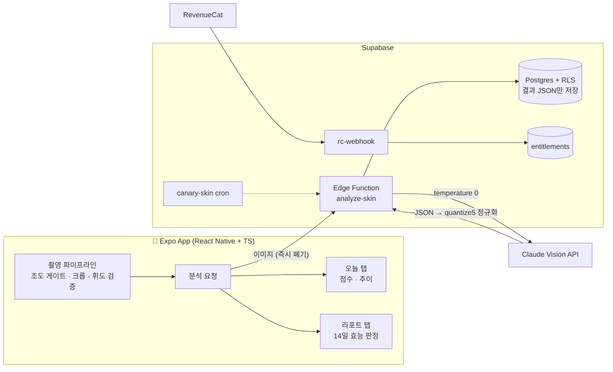

<p align="center">
  
</p>

<p align="center"><b>거울은 매일 거짓말을 합니다.</b><br/>
셀카 한 장으로 피부를 계측하고, 14일 뒤 화장품이 실제로 효과가 있었는지 판정하는 모바일 앱</p>

<p align="center">
  
  
  
  
  
</p>

<p align="center">한국어 | <a href="../../README.md">English</a></p>

---

## 무엇을 하는 앱인가

화장품을 쓰면서 "이게 진짜 효과가 있나?" 싶어도 답해주는 사람은 없습니다. SkinMe는 그 질문에 숫자로 답합니다.

- **오늘 탭**
  - 셀카를 찍으면 AI가 6개 지표(모공·피부결·트러블·유수분·붉은기·톤/색소)를 점수화합니다.
- **리포트 탭**
  - 화장품을 등록하면 14일 뒤 시작 시점 대비 개선 / 변화 없음 / 악화를 판정합니다.
  - 14일은 피부 턴오버 주기의 생물학적 하한이어서 바꾸지 않는 값입니다.
- **광고·제품 판매 완전 배제**
  - 중립적인 판정이 곧 이 제품의 존재 이유입니다.

## 숫자를 믿게 만드는 설계

측정 앱의 생명은 재현성입니다. 같은 순간을 두 번 재면 같은 숫자가 나와야 합니다. 이 프로젝트는 전 지표 재현 오차 0을 실측으로 확인한 뒤에야 다음 단계로 넘어갔습니다.

**입력 통제 (촬영 파이프라인)**
- 타원 가이드 오버레이 + 좌표 단일 소스(`constants/faceGuide.ts`)
- 조도 게이트: 극단적 암흑 차단 → 화면 백색 플래시로 조명 보정
- 한 셔터에 연사 2컷, 촬영 후 중앙 60% 휘도 판정. 미달 시 폐기·재촬영 유도
- 타원 바운딩 크롭(+10% 패딩) 후 원본 즉시 삭제

**출력 통제 (분석 파이프라인)**
- Claude Vision 호출은 `temperature 0` 고정
- 모든 점수는 5점 밴드(5의 배수). 프롬프트가 지시하고 서버측 `quantize5`가 강제합니다 (프롬프트는 지시, 코드는 강제)
- 지표 이원화: 구조 지표(모공·피부결·트러블)는 항상 점수화, 색 지표(붉은기·톤·색소)는 조명이 양호할 때만. 아니면 숨기지 않고 "측정 보류 + 사유"를 명시
- 프롬프트는 `prompts/skin-analysis-v0.3 → v0.10`으로 버전 관리, `sync-prompt` 스크립트가 로컬 원본·생성 파일·배포본 sha를 3중 검증

**서버 방어**
- Supabase RLS: 모든 테이블에 본인 행 select/insert/update/delete 정책
- 무료 사용량 캡 서버측 강제 (클라이언트 검사는 UX 방어선일 뿐)
- 카나리 cron(`canary-skin`)으로 분석 파이프라인 상시 모니터링
- 익명 인증 → 결제 시 RevenueCat webhook으로 entitlement 동기화

**프라이버시**
- 사진은 서버에 저장하지 않습니다. 분석 후 즉시 폐기하고 결과 JSON만 저장합니다.
- 로그에 base64 출력 금지, 폐기 사진도 파일 삭제까지 확인

## 아키텍처



## 스택

| 영역 | 기술 |
|---|---|
| 앱 | Expo SDK 54 · React Native 0.81 · TypeScript (strict) · expo-router |
| 촬영/센서 | expo-camera · expo-brightness · expo-sensors · expo-image-manipulator |
| 백엔드 | Supabase (익명 Auth · Postgres/RLS · Edge Functions) |
| AI 분석 | Anthropic Claude (vision, temperature 0) · 프롬프트 버전 관리 |
| 결제 | RevenueCat (구독 · webhook entitlement 동기화) |
| 빌드/배포 | EAS Build · `supabase functions deploy --use-api` |

## 프로젝트 구조

```
app/                    # expo-router 화면
  (tabs)/today.tsx      #   오늘 탭: 스냅샷·점수·추이
  (tabs)/verdict.tsx    #   리포트 탭: 제품 등록·14일 판정
  capture.tsx           #   촬영 플로우
  paywall.tsx           #   페이월
components/             # capture / today / verdict / paywall / dev
lib/
  analysis/             # 분석 요청·스키마 (zod)
  verdict/              # 판정 로직 (기준선·변화 계산)
  purchases/            # RevenueCat 연동
  faceCrop.ts luminance.ts photoQuality.ts ...
constants/              # strings.ts · faceGuide.ts (좌표 단일 소스)
supabase/
  functions/            # analyze-skin · canary-skin · rc-webhook · delete-account
  migrations/           # RLS 정책·rate limit·entitlements 등 20+ 마이그레이션
prompts/                # 분석 프롬프트 v0.3 → v0.10 (버전 관리)
scripts/sync-prompt.mjs # 프롬프트 원본↔생성물↔배포 sha 3중 검증
docs/                   # 감사 문서·보안 리뷰·테스트 체크리스트
landing/                # 랜딩 페이지·개인정보처리방침
```

## 실행하기

```bash
npm install
cp .env.example .env    # Supabase URL·anon key, RevenueCat key 입력
npx expo start
```

백엔드는 Supabase 프로젝트에 `supabase/migrations`를 적용한 뒤 edge function을 배포하면 됩니다:

```bash
supabase db push
npm run sync-prompt          # 프롬프트 → prompt.gen.ts 생성·sha 검증
supabase functions deploy analyze-skin --use-api
```

`ANTHROPIC_API_KEY`는 클라이언트에 두지 않고 `supabase secrets`로만 관리합니다.

## 개발 과정에서 지킨 것들

- **주차별 게이트**: 실기기 E2E → 재현성 오차 ≤5 (실측 0 달성) → 페이월 → 출시. 게이트 통과 전 다음 주차 착수 금지
- **셀프 감사**: 결제 우회 경로(딥링크 캡 우회 등)·보안·프라이버시를 항목별로 감사하고 `docs/audit-w3.md`에 P0/P1 우선순위로 기록
- **과학적 근거 없는 기능은 만들지 않음**: 1일/1주 단위 판정은 요청이 있어도 영구 배제

## License

MIT © dandel6
